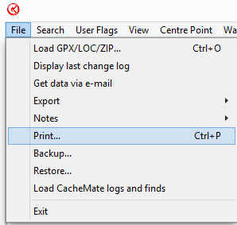
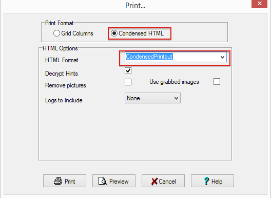

PGC_GC1M0D0.lua - Lua-based checker for the geocache [GC1M0D0 - Bellevue Blackout](https://coord.info/gc1m0d0), where the objective is to find all active geocaches, for a moment in time, within the Bellevue, WA, city limits.  The original script is based on the original by Foolie.  Version forked to ignore challenge caches and fix overflow condition in the query.

HTML\_CondensedPrintout.gsk
This is a macro used in [GSAK](http://gsak.net/) (Geocaching Swiss Army Knife) to produce a condensed printout of geocaches based on the current filters.  The original macro was written by bazzanowitz in 2008. 

#####Why you'd want this macro
On long cycling trips, where I'm away from a cellular data service, I like to have a hard-copy of caches I'm very likely to search for, especially Earthcache and Virtual pages as they often have detailed logging requirements.

#####Usage note
Unlike many macros run directly, this is invoked from the File --> Print menu.  Select HTML format =  "CondensedPrintout"

Version 1.9 (2014-06-09):

* Replaced deprecated HTML() function with [CustomFormat()](http://gsak.net/help/hs21095.htm).
* Favorite points, Linked GC code and Last Found date added to the header.
* If it's been over a year since the last find, the Last Found date will be in a red font.
* Status is indicated on the top only if it is not active/unfound.
* If no hint is specified, the hint section is omitted.
* If the cache doesn't typically have a container (e.g., Virtuals, Events), omit the container size.
* Corrected coordinates slightly more apparent, also removed the WGS84 label.
* Style sheet embedded within the data block rather than string concatenation.

Version 1.8 (2013-08-03):
* Replaced the deprecated GeoCalc command with GCalc. 
* Render the hint below the description. Previously, the hint was in a separate column, which blows up the overall page count as the browser allocates space. (And often, on earth caches and virtuals, there is "No hint.")
