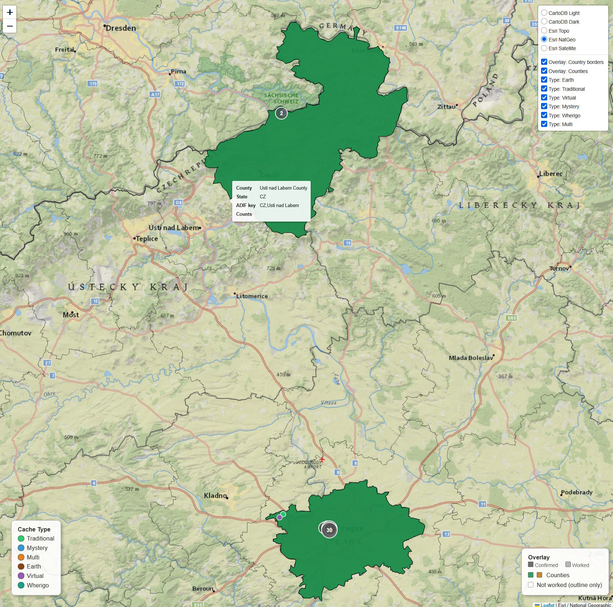
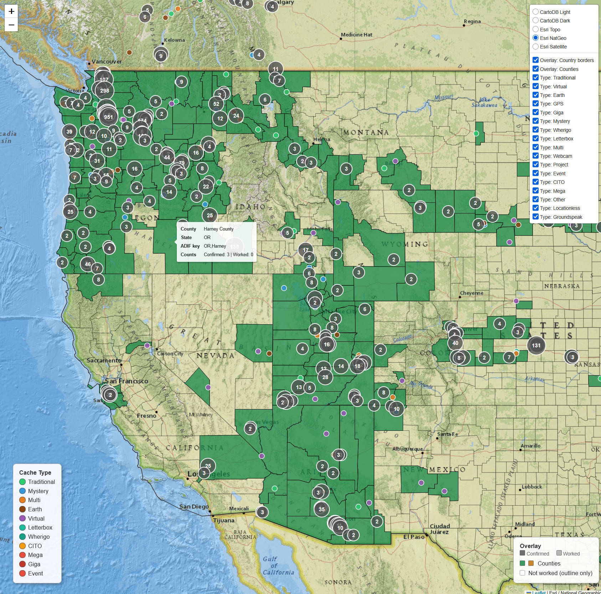
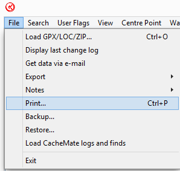
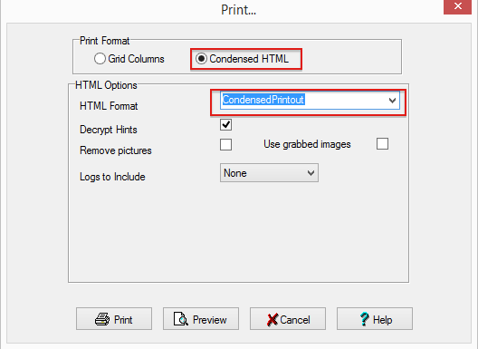

## `geocache_map.py`

Plots a GSAK GPX export on an interactive browser map. Caches are grouped by type into independently toggleable layers, clustered by zoom level, and colored by cache type. Shares all overlay and legend infrastructure with `map_core.py`.

> County lookup requires `gsak_counties.db` — build it once with `gsak_counties.py build`. Without the DB, caches without a county field in the GPX will simply have no county assigned.



### Quick Start

```bash
# Basic map — opens map_output.html beside the GPX file
python geocache_map.py caches.gpx

# With type/D-T filter panel and county overlay
python geocache_map.py caches.gpx --show-filters --overlay counties

# Filter to Earthcaches and Traditional caches, difficulty ≤ 3
python geocache_map.py caches.gpx --type earth,traditional --difficulty 1-3
```

### All Options

```
--type <LIST>           Cache type filter, comma-separated (case-insensitive prefix match)
                        e.g. --type traditional,earth,mystery
                        Types: Traditional, Mystery, Multi, Earth, Virtual,
                               Letterbox, Wherigo, CITO, Mega, Giga, Event
--difficulty MIN-MAX    Difficulty range in 0.5 steps, e.g. --difficulty 1-3.5
--terrain MIN-MAX       Terrain range in 0.5 steps,    e.g. --terrain 2-5
--found                 Show only found caches
--not-found             Show only unfound caches
--overlay <LIST>        Comma-separated overlays: states, counties
                        (requires ne_states.geojson / us_counties.geojson)
--show-filters          Show collapsible type/D/T filter panel (top-left)
--gsak-db <FILE>        GSAK county polygon DB for coordinate→county lookup
                        (default: gsak_counties.db beside the script)
--theme <FILE>          Color theme YAML (default: theme_default.yaml)
--output <FILE>         Output HTML path (default: map_output.html beside GPX)
--verbose               Show cache type breakdown
```

### Cache Type Colors

| Type                       | Color              |
| -------------------------- | ------------------ |
| Traditional                | Green              |
| Mystery / Unknown          | Blue               |
| Multi                      | Orange             |
| Earthcache                 | Brown              |
| Virtual                    | Purple             |
| Letterbox Hybrid           | Teal               |
| Wherigo                    | Teal (darker)      |
| CITO / Event / Mega / Giga | Red/amber variants |

All colors are controlled by `CACHE_TYPE_COLORS` in `geocache_map.py` — edit directly to customise.

### County Assignment

GSAK GPX exports rarely include county data. When `gsak_counties.db` is present alongside the script, `geocache_map.py` automatically looks up the county for each cache that has no county field, using point-in-polygon matching against the GSAK boundary polygons. This enables the `--overlay counties` choropleth to show found/unfound counts per county.

Build the DB once:

```bash
python gsak_counties.py build --gsak-dir gsak --country US --verbose
python gsak_counties.py build --gsak-dir gsak --country CA --verbose
```

### Filter Panel (`--show-filters`)

Injects a collapsible **Filters** panel (top-left). Sections:

- **Cache Types** — checkboxes toggle each type's FeatureGroup layer on/off
- **Difficulty** — min/max range sliders (1–5 in 0.5 steps)
- **Terrain** — min/max range sliders (1–5 in 0.5 steps)

> The D/T sliders adjust the display of caches already loaded — they do not re-filter at the Python level. For a tighter pre-filtered set, use the CLI `--difficulty` and `--terrain` arguments.

---

## `gsak_counties.py`

Builds a SQLite database of county and regional boundary polygons from GSAK `.txt` polygon files, and provides fast point-in-polygon lookup for coordinate → county assignment.

County polygon data is sourced from GSAK (Clyde Findlay and GSAK community contributors). See `CREDITS.txt` and `gsak/README.txt` for full attribution.

### Quick Start

```bash
# Build the database (run once, or after adding new polygon files)
python gsak_counties.py build --gsak-dir gsak --country US --verbose
python gsak_counties.py build --gsak-dir gsak --country CA --verbose
python gsak_counties.py build --gsak-dir gsak --country IS --verbose
python gsak_counties.py build --gsak-dir gsak --country CZ --verbose

# Verify coverage
python gsak_counties.py stats

# Look up a county by coordinates
python gsak_counties.py lookup 47.56 -122.03
python gsak_counties.py lookup 51.05 -114.07
```

### All Options

```
build
  --gsak-dir <DIR>    Root GSAK Counties directory (contains US/ and/or CA/ subdirs)
  --db <FILE>         Output DB path (default: gsak_counties.db)
  --country <CODE>    Country subdirectory to load: US or CA (default: usa)
  --verbose           Show per-state/province region counts and skip warnings

lookup <LAT> <LON>
  --db <FILE>         DB path (default: gsak_counties.db)

stats
  --db <FILE>         DB path (default: gsak_counties.db)
```

### Directory Structure

The script expects polygon files organised as:

```
gsak/
  US/
    WA/          ← 2-letter state postal code
      King.txt
      Snohomish.txt
      ...
  CA/            ← Canada
    AB/          ← 2-letter province postal code
      Calgary.txt
```

Full documentation of the directory structure, filename conventions, and coverage is in `gsak/README.txt`.

### Python API

```python
from gsak_counties import lookup_county, lookup_county_adif_key

# Returns ('WA', 'King') or (None, None) if not found / DB absent
state, county = lookup_county(47.56, -122.03)

# Returns 'WA,King' or None
key = lookup_county_adif_key(47.56, -122.03)

# With state hint for speed (bbox filter narrows candidates)
state, county = lookup_county(47.56, -122.03, state_hint='WA')
```

---

## `gsak_build_geojson.py`

Generates `us_counties.geojson` from `gsak_counties.db`, replacing the Census-derived file with higher-fidelity GSAK polygon boundaries.

### Quick Start

```bash
# Default — light simplification, ~12MB (recommended)
python gsak_build_geojson.py

# Full fidelity — ~26MB
python gsak_build_geojson.py --full

# Moderate simplification — ~8MB (if 12MB is still slow to load)
python gsak_build_geojson.py --simplify 0.001

# Custom paths
python gsak_build_geojson.py --db path/to/gsak_counties.db --out path/to/us_counties.geojson
```

### All Options

```
--db <FILE>         Path to gsak_counties.db (default: gsak_counties.db)
--out <FILE>        Output GeoJSON path (default: us_counties.geojson)
--simplify <ε>      RDP simplification tolerance in degrees
                    Default: 0.0005 (~12MB). Use 0 or --full for no simplification.
--full              Shorthand for --simplify 0 (full fidelity, ~26MB)
--verbose           Show simplification stats and namelsad spot-check
```

### Simplification Guide

| Flag                            | File size | Use case                          |
| ------------------------------- | --------- | --------------------------------- |
| `--full` or `--simplify 0`      | ~26MB     | Archival, highest detail          |
| *(default)* `--simplify 0.0005` | ~12MB     | Normal use — recommended          |
| `--simplify 0.001`              | ~8MB      | Slower machines or large overlays |

Simplification uses the Ramer-Douglas-Peucker algorithm. At county zoom levels, differences between the default and full-fidelity versions are imperceptible.

The generated file uses the same property schema as the previous Census-derived file (`adif_key`, `namelsad`, `state`, `name`) — it is a drop-in replacement with no changes required to `map_core.py` or `adif_map.py`.



## `PGC_GC1M0DO.lua`

Lua-based checker for the geocache [GC1M0D0 - Bellevue Blackout](https://coord.info/gc1m0d0), where the objective is to find all active geocaches, for a moment in time, within the Bellevue, WA, city limits.  The original script is based on the original by Foolie.  Version forked to ignore challenge caches and fix overflow condition in the query.

### `HTML_CondensedPrintout.gsk`

This is a macro used in [GSAK](http://gsak.net/) (Geocaching Swiss Army Knife) to produce a condensed printout of geocaches based on the current filters.  The original macro was written by bazzanowitz in 2008. 

#####Why you'd want this macro
On long cycling trips, where I'm away from a cellular data service, I like to have a hard-copy of caches I'm very likely to search for, especially Earthcache and Virtual pages as they often have detailed logging requirements.

#####Usage note
Unlike many macros run directly, this is invoked from the File --> Print menu.  Select HTML format =  "CondensedPrintout"






Version 1.9 (2014-06-09):

* Replaced deprecated HTML() function with [CustomFormat()](http://gsak.net/help/hs21095.htm).
* Favorite points, Linked GC code and Last Found date added to the header.
* If it's been over a year since the last find, the Last Found date will be in a red font.
* Status is indicated on the top only if it is not active/unfound.
* If no hint is specified, the hint section is omitted.
* If the cache doesn't typically have a container (e.g., Virtuals, Events), omit the container size.
* Corrected coordinates slightly more apparent, also removed the WGS84 label.
* Style sheet embedded within the data block rather than string concatenation.


Version 1.8 (2013-08-03):
* Replaced the deprecated GeoCalc command with GCalc. 
* Render the hint below the description. Previously, the hint was in a separate column, which blows up the overall page count as the browser allocates space. (And often, on earth caches and virtuals, there is "No hint.")
